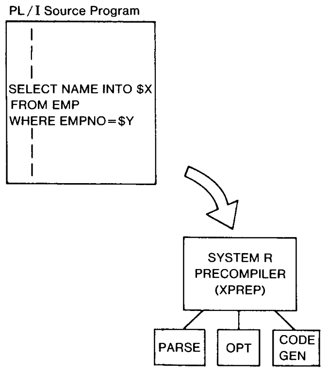
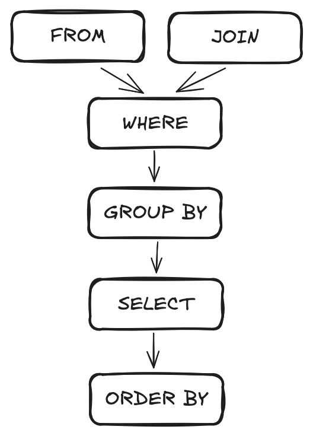

class: center, inverse, middle, title-slide

# SQL & Server

## Part I - Introduction

### Patrick Anker

.ties-footer[


]

---
class: middle, center

## Before we begin...

If you'd like to download any of the materials for this presentation, check out

**>> [the workshop's website](`r params$home`) <<**

### `r "\U1F680"`

---
class: middle, center, inverse

# History

## `r "\U1F4DA"`

---

# Ess-Cue-Ell or Sequel?

.pull-left[

Invented in 1974 by Donald Chamberlin & Raymond Boyce at IBM from the research by Edgar Cobb on **relational data models**. First appeared in _System R_,<sup>1</sup> called SQUARE, and then SEQUEL. Changed to **Structure Query Language (SQL)** due to copyright issues.

]

.pull-right[



]

.footnote[

(1): https://people.eecs.berkeley.edu/~brewer/cs262/SystemR.pdf

]

---

# SQL Server

.pull-left[

The first enterprise database with SQL was **Oracle** in 1977 (intended to be sold to the CIA). A group from Berkeley developed a competitor to Oracle in 1984 which became known as Sybase. 

In 1986, Microsoft bought a license from Sybase to port the database to Windows. In 1989, SQL Server 1.0 was released.

Needless to say, .red[SQL Server is] **.red[old]**.

]

.pull-right.right[

```{r, echo=FALSE, out.width="250px"}

```

]

---

# SQL Server is .yellow[not] SQL!

There are .red[many] SQL versions: IBM's DB2/SQL, PostgreSQL, Oracle's PL/SQL, Microsoft's **Transact SQL** (T-SQL), ANSI, and more.

--

T-SQL is the one SQL Server uses. We'll cover its oddities over the course of the workshops. Which begin with..

---
class: center, middle, inverse

# SQL: The Overview

## `r "\U1F52D"`

---

# SQL: The Overview

.pull-left[

The query language<sup>1</sup> follows this general flow:

1. `SELECT`: which columns you want
1. `FROM`: from which data you're pulling data
1. `JOIN`: any other tables you need
1. `WHERE`: include/exclude any records from table(s)
1. `GROUP BY`: aggregate rows based on these columns
1. `ORDER BY`: sort the result set based on columns in `SELECT`

]

.pull-right.font10[

```sql
SELECT 
    dm.cat_member_gender, 
    fd.str_diagnosis_code,
    count(*) as N
FROM dim_members dm
LEFT JOIN fct_diagnoses fd
    ON dm.id_member = fd.id_member
WHERE 
    upper(fd.str_diagnosis_desc) 
        LIKE '%DIABET%'
GROUP BY 
    dm.cat_member_gender,
    fd.str_diagnosis_code
ORDER BY N desc;
```

_Always end your query statements with a semicolon!_

]

--

.footnote.font10[

(1): You'll see this sometimes called "DQL" (data query language). SQL comes in four major "sublanguages": Data Query Language (DQL), Data Description Language (DDL), Data Manipulation Language (DML), and Transaction Control Language (TCL). We'll cover the 3 D's.

]

---

# SQL: The Overview

The way queries are written is not quite the way the data are retrieved.

.pull-left.font10[

.center[

#### Query

]

```sql
SELECT 
    dm.cat_member_gender, 
    fd.str_diagnosis_code,
    count(*) as N
FROM dim_members dm
LEFT JOIN fct_diagnoses fd
    ON dm.id_member = fd.id_member
WHERE 
    upper(fd.str_diagnosis_desc) 
        LIKE '%DIABET%'
GROUP BY 
    dm.cat_member_gender,
    fd.str_diagnosis_code
ORDER BY N desc;
```

]

.pull-right.font10.center[

#### Execution Plan

```{r fig-general-execution-plan, echo=FALSE, out.width="200px"}

```

]

---
class: center, middle, inverse

# Let's go to SSMS...

---
class: center, middle

# ... and we're back!

---

# Saving Work: Tables & Views

Before we close for today, we should discuss the difference between "tables" and "views."

.pull-left[

## Table

A table is a **physical** representation of data stored on disk. In other words,
once they are made, the data returned from the generating query is saved to disk.

]

.pull-right[

## View

A view is a **virtual** representation of data stored on disk. It is basically a saved query:
every time you select from a view, it has to recompute the generating query.

]

---

# Creating Views

For your work as analysts, you'll most likely be creating views in the **marts** database. This is how one would do that:

```sql
use marts;
go

create or alter view my_fun_view as
select top (100) * from wh.ipa.fct_diagnoses;
--                      ^----- refers to DB outside of current DB
go
```

---

# Exercise When You Have Time

Consider our final exercise in `01-intro.sql`. Look up [`ROW_NUMBER()`](https://learn.microsoft.com/en-us/sql/t-sql/functions/row-number-transact-sql?view=sql-server-ver16), and window functions more generally, and see how you could get the top 10 diagnoses per month all in the same table. Save that query to a view in the `marts` database.

---
class: center, middle

# Questions?
